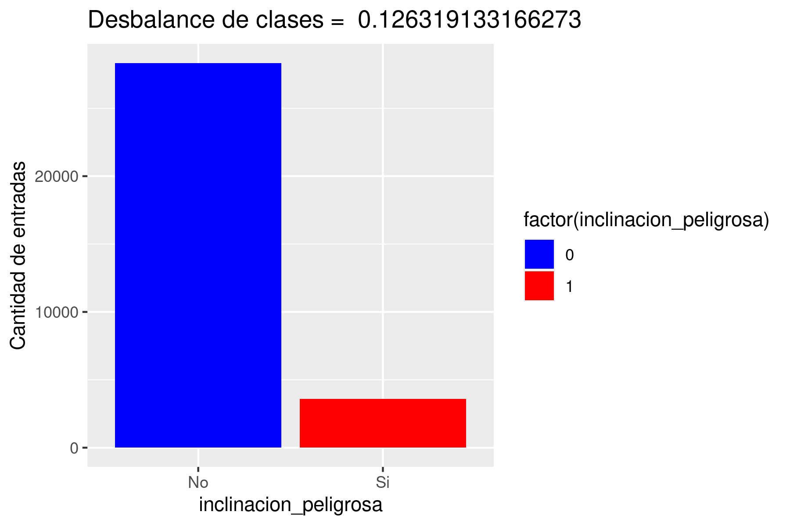
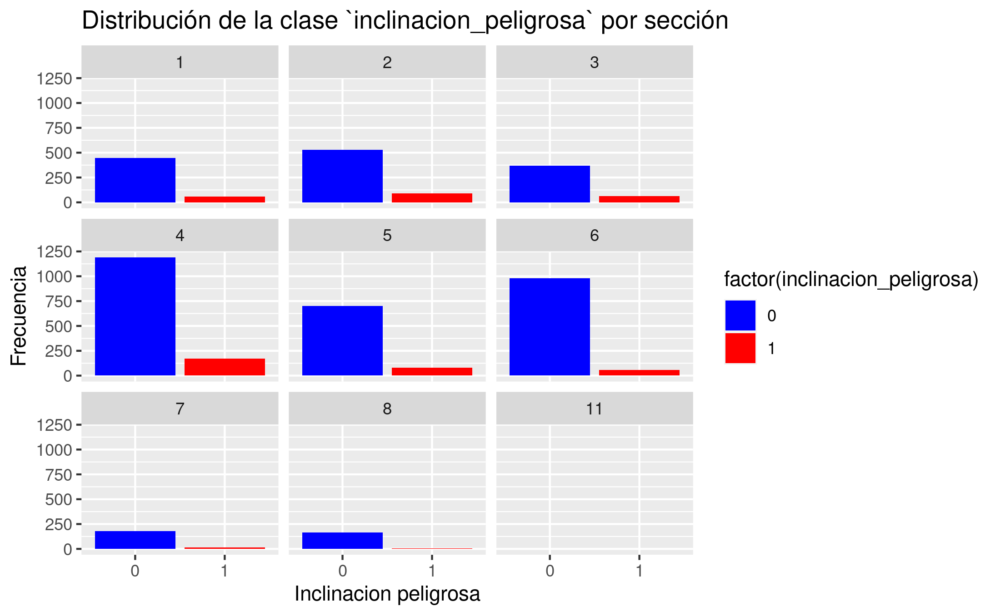
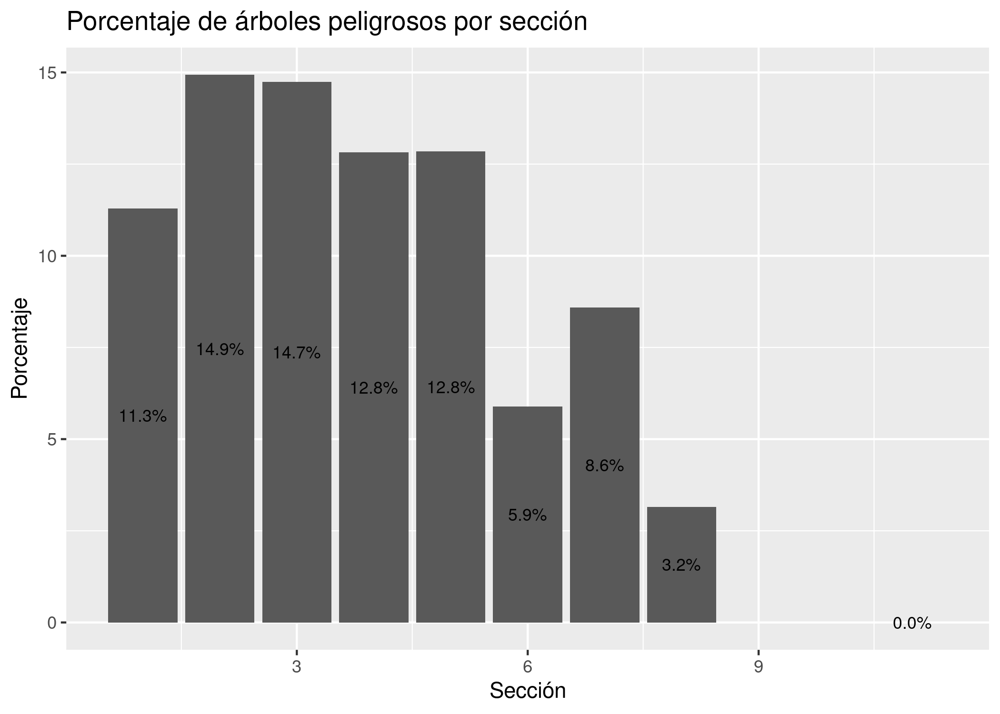
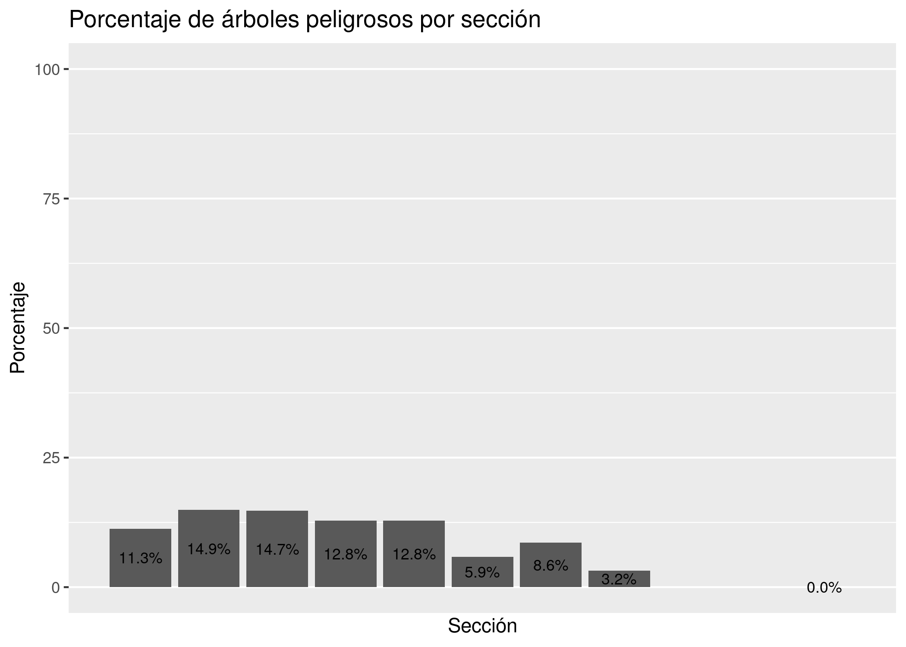
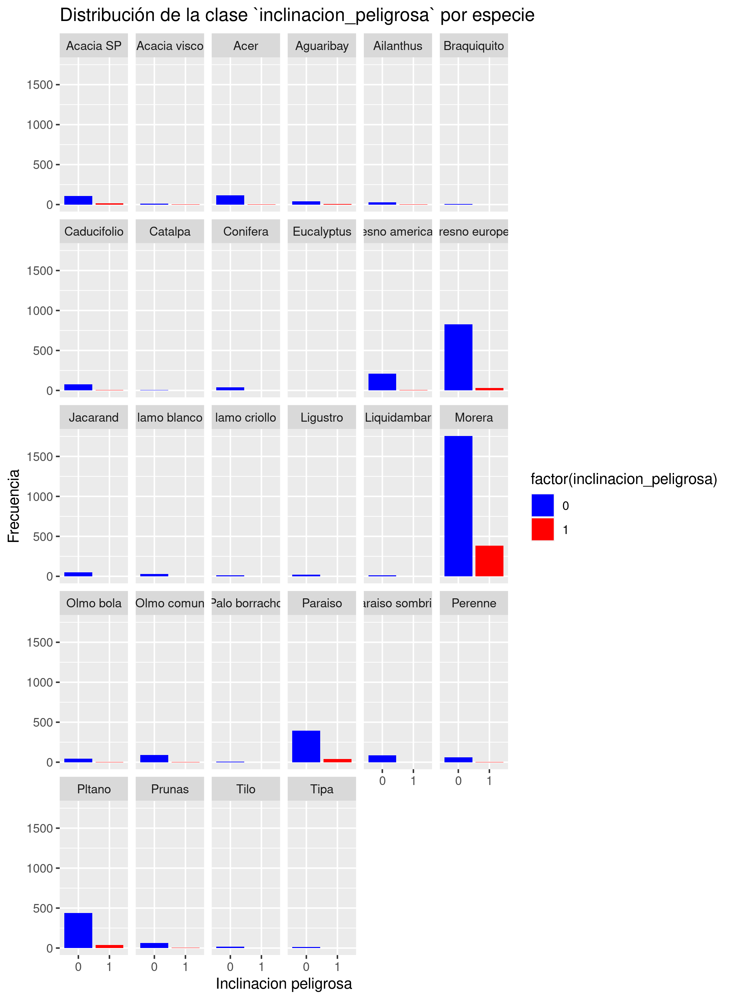

## IA 1 - 2023

# Informe Final

## Inclinación del Arbolado Público - Mendoza

### Integrantes

- Maglione, Andrés
- Silva, Yeumen

---

## Introducción

La ciudad de Mendoza es conocida por la enorme importancia que se le da a los árboles. Esta ciudad funciona como un oasis en medio del desierto que permite el desarrollo de la flora, con una gran cantidad de árboles que se encuentran en las calles y parques de la ciudad.

Más allá de su gran importancia para el medio ambiente, el arbolado publico de Mendoza forma parte del patrimonio cultural del lugar, y es un elemento que se encuentra presente en la vida cotidiana de los mendocinos, como una muestra fundamental de progreso.

Como contracara de todas las ventajas que el arbolado trae consigo, algunos ejemplares pueden llegar a traer consecuencias catastróficas. Si no se realiza el mantenimiento necesario, los árboles pueden llegar a significar un peligro para la población. Esto se ve resaltado particularmente en dos situaciones: las fuertes tormentas y las ráfagas de viento zonda.

A causa de esto, el análisis de la peligrosidad de los árboles toma un papel fundamental. El número de árboles en la ciudad es gigantesco, por lo que, si no se realizan tareas preventivas de forma inteligente y planificada, la probabilidad de que ocurran accidentes se vuelve considerablemente más alta.

El programa de _Datos Abiertos_ del gobierno de la ciudad de Mendoza nos da acceso a 181 conjuntos de datos reales con distintas temáticas. En particular, uno de los datasets consiste en información sobre el arbolado público de la ciudad, con datos como la especie, la ubicación, el diámetro del tronco, la altura, etc.

Para este proyecto, se utilizó dicho dataset para participar en un desafío de la plataforma Kaggle que consiste en predecir qué árboles tienen inclinación peligrosa (mayor a 30 grados) a partir de su información geográfica/administrativa.

## Marco Teórico

Puesto que el problema con el que nos encontramos es un problema de clasificación (en particular, un problema de clasificación binaria), debemos conocer algunos de los algoritmos que nos permiten resolver este tipo de problemas. 

Antes de comenzar a estudiar qué modelo es el apropiado para este problema, es importante analizar el dataset con el que contamos. En este caso, el dataset cuenta con 11 variables:

    id: int

    especie: string

    ultima_modificacion: date

    altura: string

    circ_tronco_cm: int

    diametro_tronco: string

    long: float

    lat: float

    seccion: int

    nombre_seccion: string

    area_seccion: float

Y también cuenta con una variable categórica que es la que se busca predecir:

    inclinacion_peligrosa: int

---

Una vez tenidos en cuenta los datos, podemos seleccionar un algoritmo de machine learning que nos permite resolver nuestro problema. A pesar de que existen incontables modelos para resolver problemas de clasificación, en este proyecto se utilizaron los siguientes:

### Árboles de decisión

### Random Forest

### Algoritmos de Boosting

### Vecinos cercanos (KNN)

---

Además de los algoritmos, es sumamente importante conocer nuestro conjunto de datos para poder llevar a cabo un análisis correcto.

El dataset del árbolado público es un dataset sumamente desbalanceado, con solo un 12% de la población perteneciente a la clase de inclinación peligrosa.

Es por esto que una de nuestras tareas más importantes fue lidiar con el desbalance de clases. Para cumplir con este requisito, se utilizaron distintas técnicas entre las cuales encontramos el oversampling, el undersampling y el SMOTE.

## Diseño experimental

### Análisis de datos

Como punto de partida para comenzar con la predicción, debemos comenzar conociendo nuestro conjunto de datos. En este análisis exploratorio nos cojncentramos en entender cómo se distribuyen nuestros datos, hallar qué variables son importantes y cuáles pueden ser omitidas

Para comenzar, se realizaron diferentes histogramas de frecuencia para intentar detectar cuáles variables tenían una correlación positiva con la inclinación peligrosa

En primera instancia, se llevó a cabo el histograma dividiendo los datos por sección, y a simple vista se ve que todas las secciónes tienen aproximadamente la misma cantidad de árboles peligrosos.

De todos modos, al analizar el porcentaje de árboles peligrosos por sección, podemos ver que existen tres tipos de secciones: algunas tienen aproximadamente 13% de árboles peligrosos, otras tienen alrededor de un 8%, mientras que otras no tienen ningún árbol con inclinación peligrosa.

También se analizó la distribución de árboles peligrosos por especie.

A simple vista, podemos ver que la especie _Morera_ no solo tiene muchísimas más entradas, sino que también posee muchas entradas con inclinación peligrosa.

Podemos observar que el 18% de las Moreras tienen inclinación peligrosa, un número considerablemente superior al de las otras especies.

<!-- matriz de dependencias -->

### Preprocesamiento de datos

Una vez que conocemos nuestro conjunto de datos, debemos realizar un preprocesamiento de los mismos para poder utilizarlos en nuestros modelos. En esta etapa, se realizaron las siguientes tareas.

- **Eliminación de variables**: se eliminaron las variables que no aportaban información relevante para la predicción. Entre ellas, podemos encontrar al ID de los árboles, la fecha de modificación y algunas variables sumamente correlacionadas que no aportan datos significativos, como lo son el nombre de la sección, entre otras.
- **Creación de variables nuevas**: también se crearon nuevas variables para intentar mejorar la performance de nuestro modelo. Un ejemplo de ello fue la creación de la variable _diametro_tronco_cat_, una variable categórica para el diámetro del tronco que nace del análisis de la variable original _diametro_tronco_.
- **Balanceo de clases**: en esta etapa se aplicaron las tres técnicas mencionadas anteriormente para lidiar con el desbalance de clases. La técnica con el mejor resultado fue _oversampling_, mientras que el desempeño de SMOTE fue sumamente pobre

### Entrenamiento

Una vez manipulados nuestros datos, comenzamos con la etapa de entrenar diversos modelos de clasificación para este problema.

Esta etapa supuso un límite en el alcance de este proyecto: mientras que algunos algoritmos fueron sumamente rápidos de entrenar, otros (en particular aquellos presentes en la librería _Caret_) demandaban una enorme cantidad de tiempo. A causa de esto, no se pudo entrenar todos los modelos que se hubieran deseado con la cantidad de parámetros necesarios para garantizar el mejor resultado.

## Análisis y discusión de resultados

## Conclusiones finales
