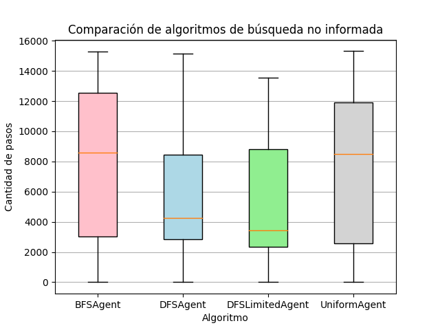

# Trabajo pr+actico n°3 - Búsqueda no informada

### B) Ejecutar un total de 30 veces cada algoritmo en un escenario aleatorio con una tasa de obstáculos del 8 por ciento, calcular la media y la desviación estándar de la cantidad de estados explorados para llegar al destino (si es que fue posible). Evaluar cada uno de los algoritmos sobre el mismo conjunto de datos generado.  Presentar los resultados en un gráfico de cajas y bigotes o boxplots

Luego de realizar las 30 ejecuciones de cada algoritmo, se obtuvieron los siguientes resultados:

En el gráfico podemos ver que los algoritmos de búsqueda en profundidad tienen una performance un poco mejor en cuanto a cantidad de estados visitados, aunque hay que tener en cuenta que, en la búsqueda por profundidad limitada, la media se encuentra sesgada por el límite de estados que se le impone al algoritmo.

### C)  Cuál de los 3 algoritmos considera más adecuado para resolver el problema planteado en A)?. Justificar la respuesta.

En mi opinión, luego de haber testeado con diferentes tamaños de la matriz y diferentes porcentajes de obstáculos, el algoritmo de búsqueda en profundidad es el más adecuado para resolver el problema planteado en A). Esto se debe a que, en la mayoría de los casos, la cantidad de estados visitados es menor que en los otros dos algoritmos, y además, en los casos en los que la cantidad de estados visitados es mayor, la diferencia no es tan grande como para que sea un factor determinante.
De todos modos, si las condiciones del problema cambiaran ligeramente y también nos interesara que los caminos encontrados sean los más cortos, entonces el algoritmo de BFS sería el más apropiado, ya que su rendimiento no es considerablemente mayor y nos garantiza encontrar el camino más corto

### Otros gráficos

**Visualización de DFS**

**Visualización de BFS**
