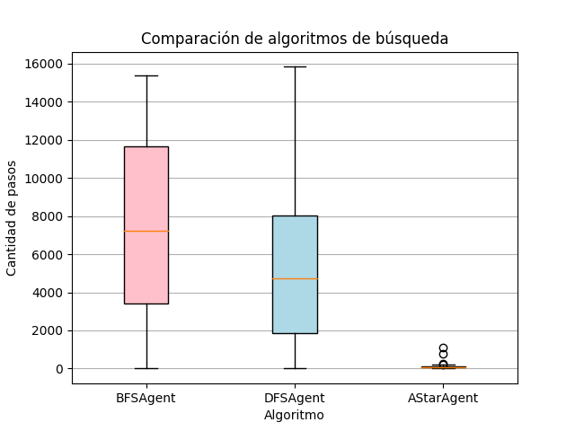

# TP4 - Busqueda Informada
Para realizar estos ejercicios, se propone la siguiente heuristica:
$h(n) = 2 \cdot distancia(n, goal)$, donde $distancia(n,goal)$ representa la distancia Manhattan entre un nodo y el nodo objetivo.
Por lo tanto, la función de costo, $f(n)$ queda definida como: $f(n) = g(n) + h(n)$, donde $g(n)$ es el costo del camino desde el nodo inicial hasta el nodo $n$.

## Performance de A*
Utilizando la función de distancia mostrada anteriormente, podemos ver que $A^\*$ tiene un rendimiento mucho mejor que el de búsqueda en profundidad, ya que la cantidad de nodos expandidos es mucho menor. Esto se debe a que la heuristica utilizada es admisible, es decir, nunca sobreestima el costo de llegar al nodo objetivo. Por lo tanto, $A^\*$ siempre encuentra el camino óptimo.

