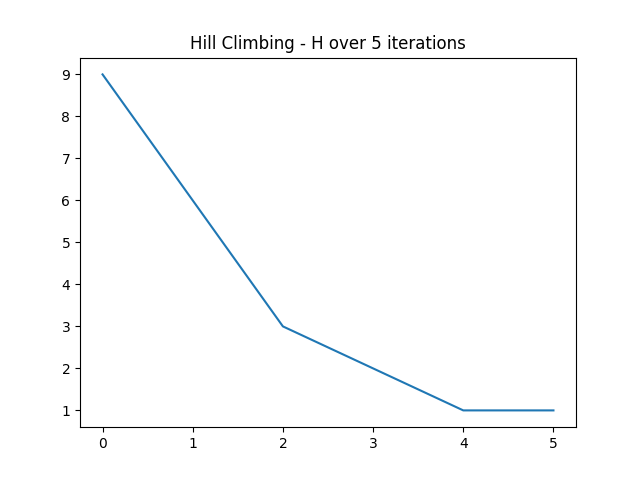
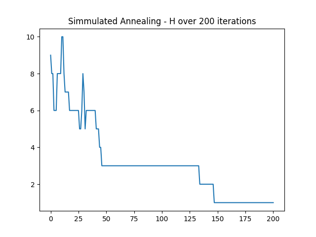
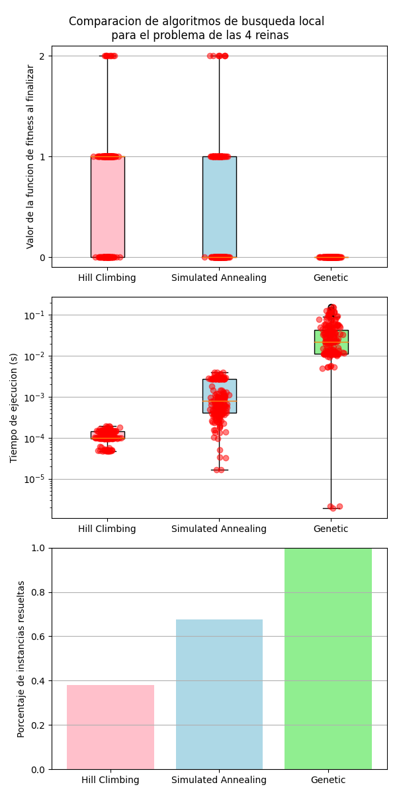
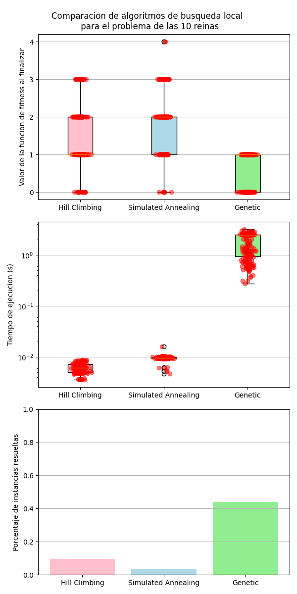
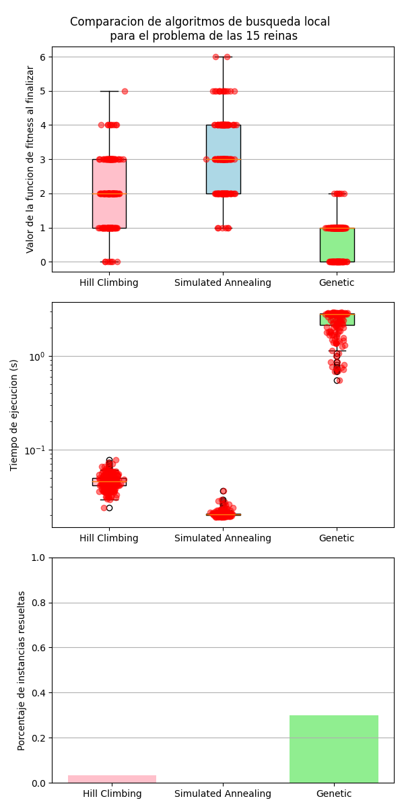

# Trabajo práctico n° 5 - Búsqueda Local

## Ejercicio 1
Algoritmos para resolver el problema de las $n$ reinas

### A) Hill Climbing
En la siguiente imagen se puede ver el valor de la función $h$

### B) Simulated Annealing

### C) Algoritmos Geneticos
Luego de parametrizacion del modelo mediante prueba de error, se implementaron los siguientes operadores
- **Seleccion**: Proporcional al valor de fitness
- **Crossover**: Crossover de un punto aleatorio
- **Mutacion**: Mutacion de un gen aleatorio
- **Reemplazo**: Elitismo

A continuacion se puede ver el valor de fitness de una iteracion, y algunas comparaciones entre diferentes algoritmos probados.

# Ejercicio 2
Comparación de algoritmos de búsqueda local para resolver el problema de las $n$ reinas.
Se realizaron 50 iteraciones y se obtuvieron los siguientes resultados:

# Cuál es el más óptimo?
Para definir cuál es el algoritmo más apropiado, primero debemos definir cuál es el objetivo que buscamos alcanzar.

Para el problema de las $n$ nos interesa maximizar el porcentaje de instancias resueltas, los algoritmos genéticos han demostrado ser los más adecuados. Seguramente, mediante prueba y error, podamos encontrar algunas funciones de mutación, reemplazo o selección que maximicen aún más su performance y resuelvan una mayor cantidad de instancias.

Si consideráramos que los óptimos locales son aceptables, el rendimiento de hill climbing se ve prometedor: Su tiempo de ejecución es mucho menor que el de los algoritmos genéticos, y, a pesar de que no consigue resolver una gran cantidad de instancias, por lo general llega a un resultado bastante bueno.