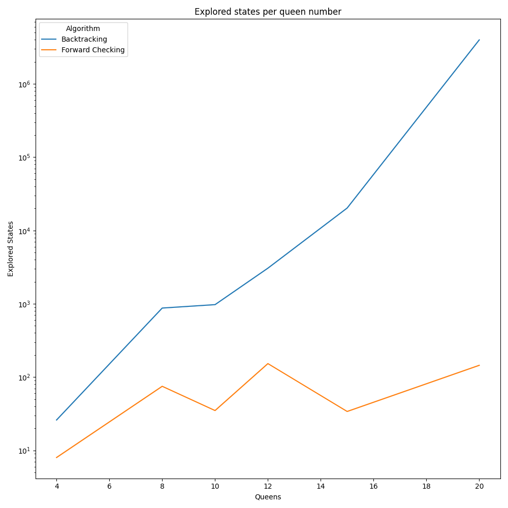
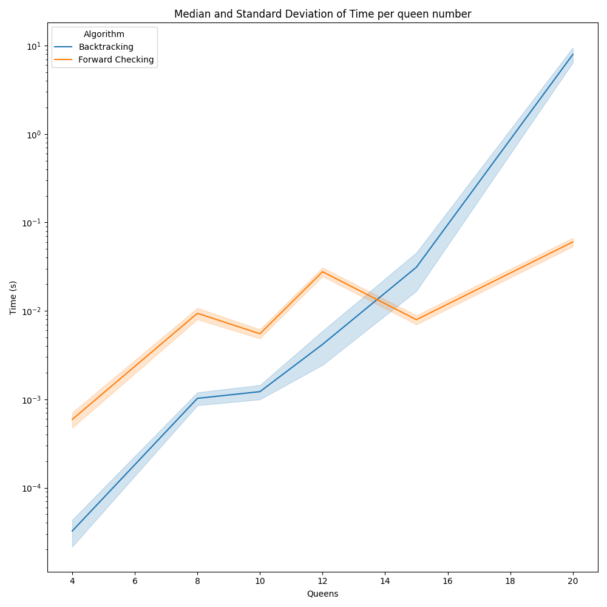

# TP6 - CSP

<b>Describir en detalle una formulación CSP para el Sudoku.</b>

Una formulación CSP para el sudoku tiene el siguiente aspecto

- Variables: $\{ A_1, A_2, A_3,\dots, A_9, B_1,\dots, B_9,\dots, I_9\}$ (es decir, 81 variables en total)

- Dominio: $\{1,2,3,4,5,6,7,8,9\}$
  
- Restricciones
  - Para cada fila, las variables deben tomar valores distintos: 
    - $A_1 \neq A_2 \neq A_3 \neq \dots \neq A_9$, 
    - $B_1 \neq B_2 \neq B_3 \neq \dots \neq B_9$, 
    - $\dots$ 
    - $I_1 \neq I_2 \neq I_3 \neq \dots \neq I_9$
  - Para cada columna, las variables deben tomar valores diferentes:
    - $A_1 \neq B_1 \neq C_1 \neq \dots \neq I_1$,
    - $A_2 \neq B_2 \neq C_2 \neq \dots \neq I_2$,
    - $\dots$
    - $A_9 \neq B_9 \neq C_9 \neq \dots \neq I_9$
  - Para cada cuadricula, las variables deben tomar diferentes valores:
    - $A_1 \neq A_2 \neq A_3 \neq B_1 \neq B_2 \neq B_3 \neq C_1 \neq C_2 \neq C_3$
    - $A_4 \neq A_5 \neq A_6 \neq B_4 \neq B_5 \neq B_6 \neq C_4 \neq C_5 \neq C_6$
    - $A_7 \neq A_8 \neq A_9 \neq B_7 \neq B_8 \neq B_9 \neq C_7 \neq C_8 \neq C_9$
    - $\dots$
    - $G_1 \neq G_2 \neq G_3 \neq H_1 \neq H_2 \neq H_3 \neq I_1 \neq I_2 \neq I_3$ 

 

<b>
Utilizar el algoritmo AC-3 para demostrar que la arco consistencia puede detectar la inconsistencia de la asignación parcial {WA=red, V=blue} para el problema del colorar el mapa de Australia (Figura 5.1 AIMA 2da edición ).
Si partimos desde la asignación parcial $\{WA = red, V = blue \}$, el algoritmo AC-3 detecta la inconsistencia de la siguiente manera:

</b>

<b>Dominios de las variables</b> 

- $WA = \{red\}$
- $NT = \{red, green, blue\}$
- $Q = \{red, green, blue\}$
- $NSW = \{red, green, blue\}$
- $V = \{blue\}$
- $SA = \{red, green, blue\}$
- $T = \{red, green, blue\}$

**Arcos**
- $(SA, WA)$
- $(SA, NT)$
- $(SA, Q)$
- $(SA, NSW)$
- $(SA, V)$
- $(NT, Q)$
- $(NT, SA)$
- $(NT, WA)$
- $(Q, NSW)$
- $(Q, NT)$
- $(Q, SA)$
- $\cdots$

Convenientemente, podemos comenzar analizando los arcos que parten de $SA$. Al tomar el arco $(SA, WA)$, se restringe el dominio de $SA$ de la siguiente manera:

- $WA = \{red\}$
- $NT = \{red, green, blue\}$
- $Q = \{red, green, blue\}$
- $NSW = \{red, green, blue\}$
- $V = \{blue\}$
- $SA = \{green, blue\}$
- $T = \{red, green, blue\}$

Ademas, se agregan los arcos $(WA, SA)$ y $(V, SA)$ a la cola de arcos a analizar. 

Al tomar el arco $(SA, V)$ se restringe el dominio de $SA$ de la siguiente manera:

- $WA = \{red\}$
- $NT = \{red, green, blue\}$
- $Q = \{red, green, blue\}$
- $NSW = \{red, green, blue\}$
- $V = \{blue\}$
- $SA = \{green\}$
- $T = \{red, green, blue\}$

No se agregan arcos ya que estan todos en la cola

Al tomar el arco $(NT, WA)$ se restringe el dominio de $NT$ de la siguiente manera:

- $WA = \{red\}$
- $NT = \{green, blue\}$
- $Q = \{red, green, blue\}$
- $NSW = \{red, green, blue\}$
- $V = \{blue\}$
- $SA = \{green\}$
- $T = \{red, green, blue\}$

Se agrega el arco $(WA, NT)$ a la cola.

Al tomar el arco $(NT, SA)$ se restringe el dominio de $NT$ de la siguiente manera:

- $WA = \{red\}$
- $NT = \{blue\}$
- $Q = \{red, green, blue\}$
- $NSW = \{red, green, blue\}$
- $V = \{blue\}$
- $SA = \{green\}$
- $T = \{red, green, blue\}$

No se agregar arcos a la cola

Ahora tomamos el arco $(NT, Q)$

- $WA = \{red\}$
- $NT = \{blue\}$
- $Q = \{red, green\}$
- $NSW = \{red, green, blue\}$
- $V = \{blue\}$
- $SA = \{green\}$
- $T = \{red, green, blue\}$

Tomamos el arco $(SA, Q)$

- $WA = \{red\}$
- $NT = \{blue\}$
- $Q = \{red,\}$
- $NSW = \{red, green, blue\}$
- $V = \{blue\}$
- $SA = \{green\}$
- $T = \{red, green, blue\}$

Tomamos el arco $(Q, NSW)$

- $WA = \{red\}$
- $NT = \{blue\}$
- $Q = \{red,\}$
- $NSW = \{green, blue\}$
- $V = \{blue\}$
- $SA = \{green\}$
- $T = \{red, green, blue\}$

Tomamos el arco $(SA, NSW)$

- $WA = \{red\}$
- $NT = \{blue\}$
- $Q = \{red,\}$
- $NSW = \{blue\}$
- $V = \{blue\}$
- $SA = \{green\}$
- $T = \{red, green, blue\}$

Al tomar el arco $(V, NSW)$, el dominio de $NSW$ pasa a ser vacio, por lo que se detecta la inconsistencia. El algoritmo AC-3 termina en este punto.

 

<b>
Cuál es la complejidad en el peor caso cuando se ejecuta AC-3 en un árbol estructurado CSP. (i.e. Cuando el grafo de restricciones forma un árbol: cualquiera dos variables están relacionadas por a lo sumo un camino).

</b>

Cuando el grafo de restricciones forma un arbol, podemos *aplanar* dicho arbol a traves de un topological sort. En ese caso, la complejidad en el peor caso resulta $O(n \cdot d^2)$, donde $n$ es la cantidad de variables y $d$ es el tamaño del dominio de las variables.

 

  

    <b>AC-3 coloca de nuevo en la cola todo arco ( Xk, Xi) cuando cualquier valor es removido del dominio de Xi incluso si cada valor de Xk es consistente con los valores restantes de Xi. Supongamos que por  cada arco ( Xk,Xi)  se puede llevar la cuenta del número de valores restantes de Xi que sean consistentes con cada valor de Xk . Explicar como actualizar ese número de manera eficiente y demostrar que la arco consistencia puede lograrse en un tiempo total O(n2d2 ) </b>
  

  Si dicho supuesto fuera posible, podríamos mantener una matrix de $n \times d$ donde cada fila representa una variable y cada columna representa un valor en el dominio de dicha variable. De este modo, podríamos mantener un contador de la cantidad de valores consistentes para cada valor en el dominio de cada variable.

  Ahora, cuando se remueve un valor $v$ del dominio de una variable $X_i$, podemos decrementar el contador de la fila $X_i$ y la columna $v$ en 1. De este modo, podemos saber cuantos valores consistentes quedan para cada valor en el dominio de cada variable.

  Esto disminuye la complejidad del algoritmo, volviendolo $O(n^2 \cdot d^2)$.

 

<b>
Demostrar la correctitud del algoritmo CSP para  árboles estructurados.  Para ello, demostrar: 

- Que para un CSP cuyo grafo de restricciones es un árbol, 2-consistencia (consistencia de arco) implica n-consistencia (siendo n número total de variables)
- Argumentar por qué lo demostrado en a. es suficiente. 

</b>

**Demostración**
Supongamos que el CSP es $2$-consistente. Esto implica que, para cualquier par de variables $(X_i, X_j)$, las restricciones en $R(X_i, X_j)$ no excluyen ninguna combinación de valores en $D(X_i) \times D(X_j)$.

Dado que el grafo de restricciones forma un árbol, podemos recorrer este árbol desde las hojas hasta la raíz (el algoritmo planteado en AIMA aporta una forma eficiente de realizar este recorrido). En cada paso, podemos seleccionar un nodo y verificar que las restricciones entre ese nodo y sus padres son consistentes. Dado que el árbol no tiene ciclos, este proceso se puede llevar a cabo en un orden tal que cuando lleguemos a un nodo en particular, ya hayamos verificado la consistencia de todas las restricciones con sus hijos.

Ahora, consideremos cualquier variable $X_i$ en el CSP. Cuando llegamos a $X_i$ en el proceso de recorrido, ya hemos verificado la consistencia de todas las restricciones con sus hijos. Esto significa que todas las restricciones en $R(X_i, X_j)$, donde $X_j$ es un hijo de $X_i$, son consistentes.

Sin embargo, no hemos verificado la consistencia de las restricciones entre $X_i$ y sus padres en este punto. Pero dado que hemos recorrido el árbol de manera que primero verificamos las restricciones con los hijos y luego con los padres, podemos estar seguros de que cuando finalmente verificamos las restricciones con los padres de $X_i$, también serán consistentes.

De este modo, podemos asegurar la $n$-consistencia ya que, para cualquier par de variables $(X_i, X_j)$, las restricciones en $R(X_i, X_j)$ no excluyen ninguna combinación de valores en $D(X_i) \times D(X_j)$.

 

  

Implementar una solución al problema de las n-reinas utilizando una formulación CSP

- Implementar una solución utilizando backtracking 
- Implementar una solución utilizando encadenamiento hacia adelante. 
- En cada variante, calcular los tiempos de ejecución para los casos de 4, 8, 10, 12 y 15 reinas.
- En cada variante, calcular la cantidad de estados recorridos antes de llegar a la solución para los casos de 4, 8, 10, 12 y 15 reinas.
- Realizar un gráfico de cajas para los puntos c y d.

  

  Para realizar estos ejercicios se implementó una versión de encadenamiento hacia adelante que utiliza una heurística de selección de variable que elige la variable con menor cantidad de valores en su dominio. De este modo, se intenta reducir la cantidad de estados recorridos antes de llegar a la solucion.

  A continuación se muestran los resultados obtenidos para backtracking y encadenamiento hacia adelante, tanto en el tiempo de ejecución de cada algoritmo como en la cantidad de estados explorados. Se decidió no utilizar un boxplot ya que ambos algoritmos son completamente determinísticos si parten de una solución vacía, por lo que la diferencia en las mediciones solo puede percibirse ligeramente en los tiempos de ejecución

  **Nota:** La escala del eje $y$ es logarítmica en ambos casos para poder apreciar las diferencias

  
  

  A partir de estos gráficos se puede ver que fordward chaining siempre explora menos estados que backtracking, y el tiempo de ejecución aumenta a un ritmo mucho menor que el del backtracking, a pesar de tener un overhead que reduce la performance en instancias pequeñas. 

  Analizando los resultados, podemos apreciar que, para backtracking,  la solución de problemas de $n >= 20$ se vuelve extremadamente costosa, mientras que fordward chaining sigue siendo viable para instancias de dicho tamaño.

