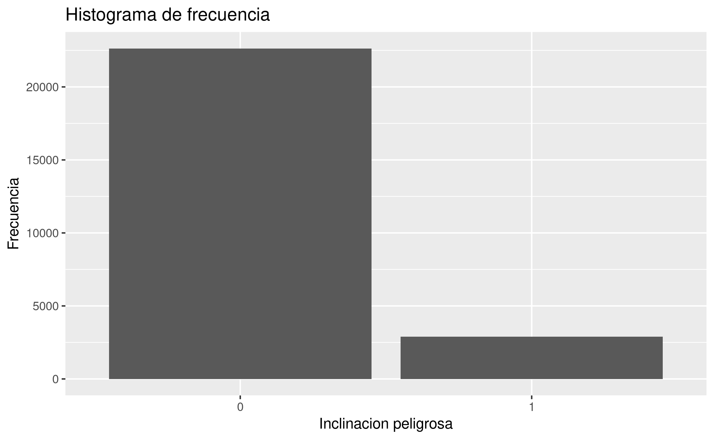
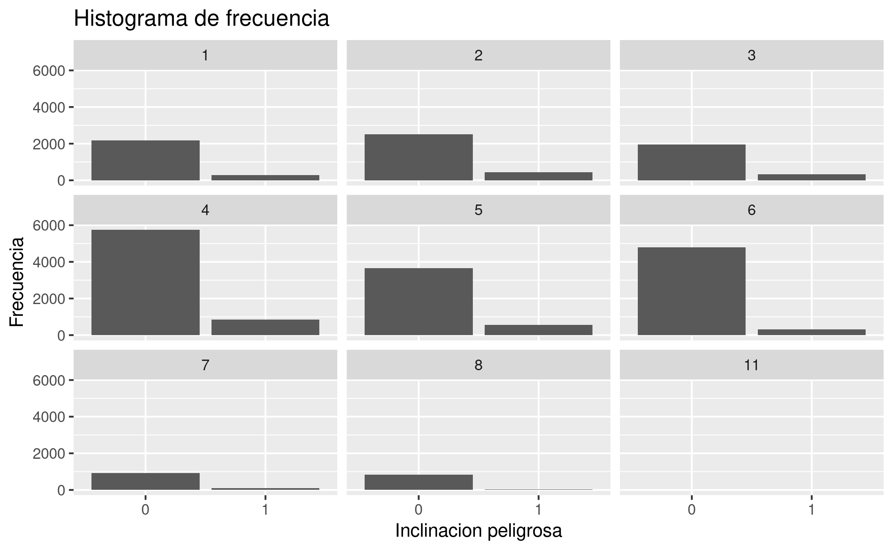
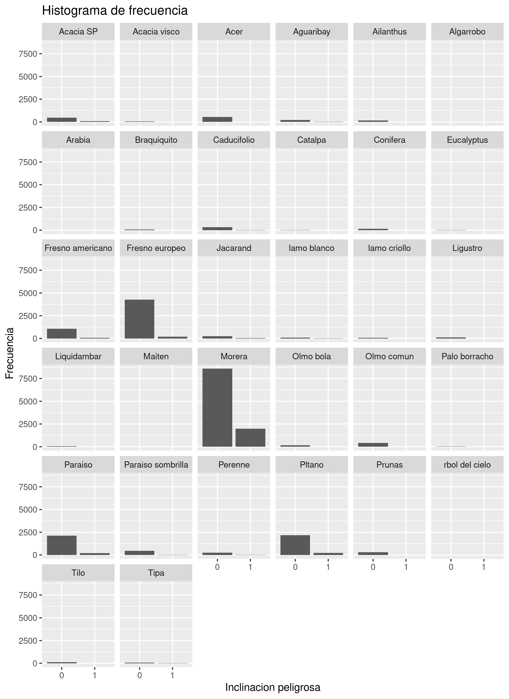
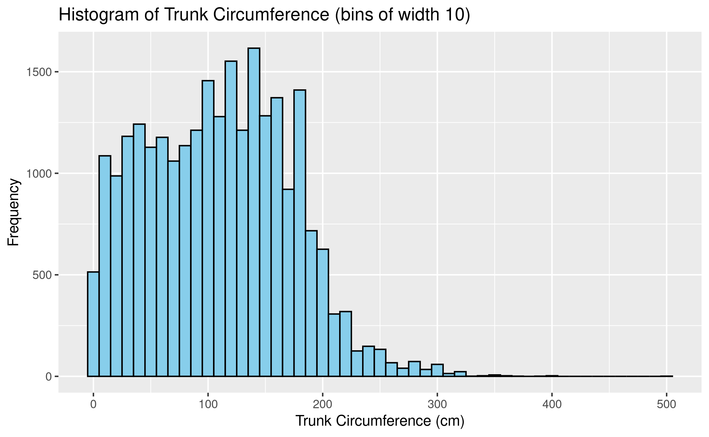
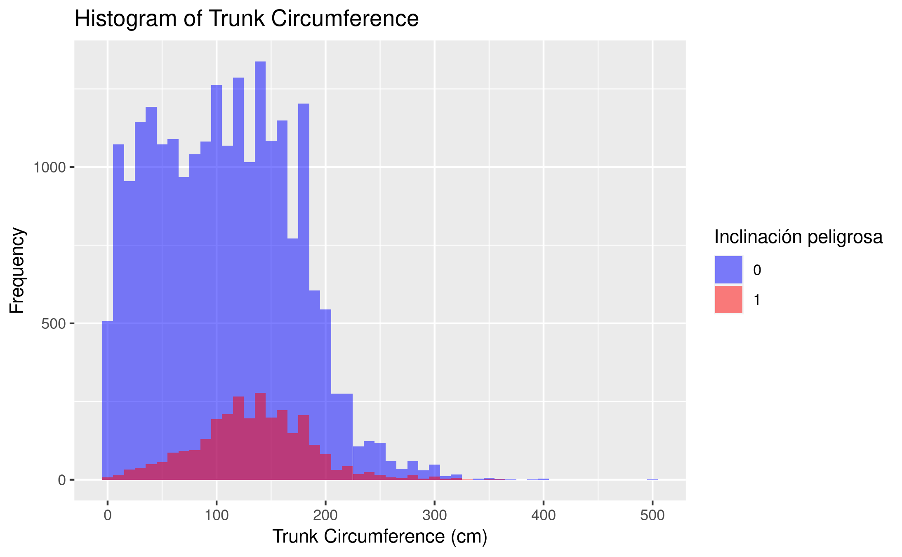

# TP7 - ML

### A partir del archivo arbolado-mendoza-dataset-train.csv responder las siguientes preguntas:
**- Cual es la distribución de las clase inclinacion_peligrosa?**

La distribución de la clase *inclinación_peligrosa* puede verse a continuación. Una enorme mayoría de los árboles no presentan inclinación peligrosa, mientras que una minoría sí lo hace.



**- ¿Se puede considerar alguna sección más peligrosa que otra?**

A partir del siguiente histograma, podemos apreciar que la distribución por sección es muy similar, con la diferencia de que algunas secciones presentan muchas más observaciones



**- ¿Se puede considerar alguna especie más peligrosa que otra?**

Al generar un gráfico de barras para la distribución de la clase *inclinación_peligrosa* por especie, podemos ver que la especie *Morera* presenta, con diferencia, la mayor parte de los casos con inclinación peligrosa.
También es evidente que muchas de las especies presentan una muy baja cantidad de observaciones



### A partir del archivo arbolado-mendoza-dataset-train.csv

**- Generar un histograma de frecuencia para la variable circ_tronco_cm. Probar con diferentes  números de bins.**  



**- Repetir el punto b) pero separando por la clase de la variable inclinación_peligrosa**


**- Crear una nueva variable categórica de nombre circ_tronco_cm_cat a partir circ_tronco_cm, en donde puedan asignarse solo  4 posibles valores [ muy alto, alto, medio, bajo ]. Utilizar la información del punto b. para seleccionar los puntos de corte para cada categoría.**

```
categorize_circ <- function(value){
  if (value < 80){
    return("bajo")
  }
  else if (value < 190){
    return("medio")
  }
  else if (value < 250){
    return("alto")
  }
  else {
    return("muy alto")
  }
}

df_train <- df_train %>% dplyr::mutate(circ_tronco_cm_cat = sapply(circ_tronco_cm, categorize_circ))
```

**- Guardar el nuevo dataframe bajo el nombre de arbolado-mendoza-dataset-circ_tronco_cm-train.csv**
```
readr::write_csv(df_train, "./data/arbolado-mendoza-dataset-circ_tronco_cm-train.csv")
```
