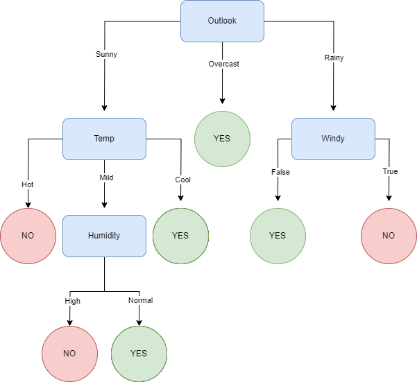

# TP7 - ML

## Parte C: Árboles de decisión

### Resultados sobre tennis.csv

### Arboles de decisión para datos de tipo real

El algoritmo para árboles de decisión para variables discretas puede ser extendido para variables continuas de la siguiente manera: a la hora de generar distintas ramas según los valores de una variable, ya no podemos crear una rama para cada valor, como hacemos para los datos discretos. Ya que existen infinitos valores, lo que debemos hacer es particionar esos valores en $n$ intervalos.

Para lograr esto, debemos definir una nueva función de ganancia de información, esta vez para definir cómo particionar cada variable continua. A partir de esto, el algoritmo se mantiene igual, con la diferencia de que ahora, en vez de crear una rama por cada valor, creamos una rama por cada intervalo.
